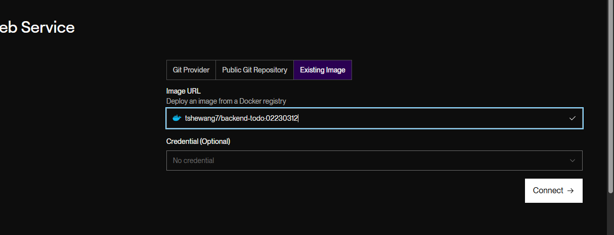
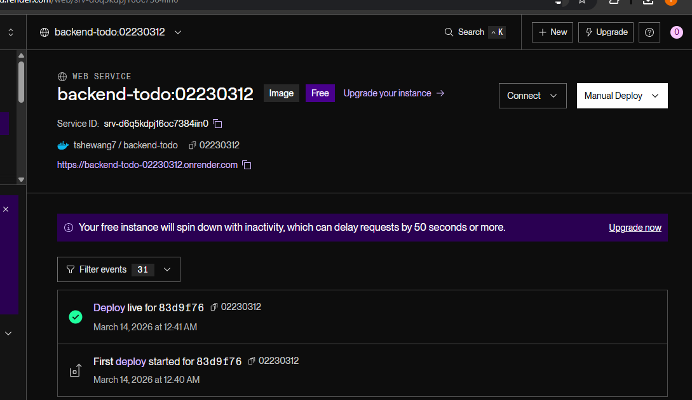
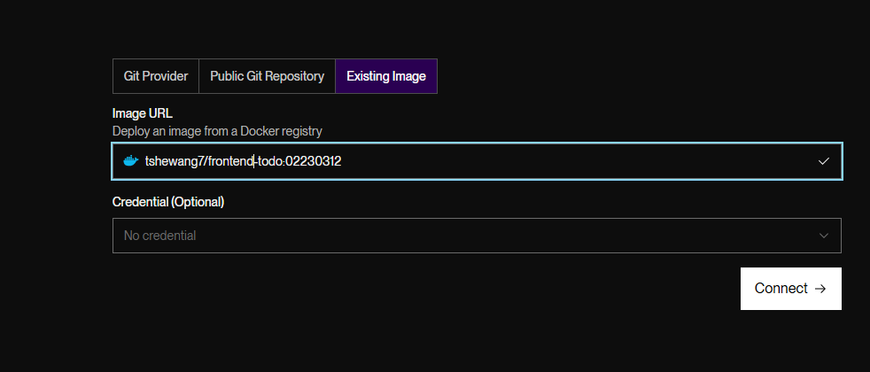
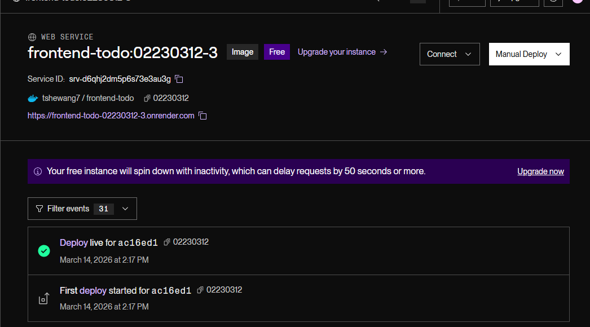

# DSO101 Assignment I

## Continuous Integration and Continuous Deployment

**Student Name:** Tshewang Dorji 

**Student Number:** 02230312

**Module:** DSO101 – Continuous Integration and Continuous Deployment

**Assignment:** To-Do List Web Application Deployment

---  

# 1. Introduction

In this assignment, I developed and deployed a **simple To-Do List web application** using a containerized architecture with Docker. The application consists of three main components:

* **Frontend (FE):** User interface to manage tasks
* **Backend (BE):** API for CRUD operations
* **Database (DB):** Storage of tasks using SQLite

The main objective of this assignment was to understand how **Docker, Docker Hub, and Render** can be used to deploy and automate the build and deployment of a web application.

The assignment was completed in two parts:

* **Part A:** Building Docker images and deploying them on Docker Hub and Render
* **Part B:** Automating deployment using a Git repository and `render.yaml`

---

# 2. Technology Stack

The technologies used in this project are:

| Component        | Technology        |
| ---------------- | ----------------- |
| Frontend         | React             |
| Backend          | Node.js + Express |
| Database         | SQLite            |
| Containerization | Docker            |
| Image Registry   | Docker Hub        |
| Deployment       | Render            |
| Version Control  | GitHub            |

SQLite was used as the database because it is lightweight and easy to configure for small applications.

---

# 3. Application Architecture

The application follows a **three-tier architecture**:

```
Frontend (React)
        |
        | HTTP API Requests
        |
Backend (Node.js + Express)
        |
        | Database Queries
        |
Database (SQLite)
```

The frontend communicates with the backend through REST APIs, and the backend performs database operations on the SQLite database.

---

# 4. Environment Variables

Environment variables were used to configure environment-specific values such as server ports and API endpoints.

## Backend `.env`

```
PORT=5000
DB_PATH=./data/todos.db

```

These variables configure the backend server and database settings.

## Frontend `.env`

```
VITE_API_URL=http://localhost:5000
```

This variable defines the backend API endpoint used by the frontend.

The `.env` files were **added to `.gitignore`** to ensure sensitive configuration data was not committed to the repository.

---

# 5. Part A – Docker Image Build and Deployment

## 5.1 Dockerizing the Backend

I created a **Dockerfile** for the backend service.

### Backend Dockerfile

```dockerfile
FROM node:18-alpine

WORKDIR /app

COPY package*.json ./
RUN npm ci --omit=dev

COPY . .

ENV PORT=5000
ENV DB_PATH=/var/data/todos.db

EXPOSE 5000

CMD ["node", "src/server.js"]

```

This Dockerfile performs the following tasks:

1. Uses Node.js 18 Alpine as the base image
2. Sets the working directory
3. Installs dependencies
4. Copies the application files
5. Exposes port 5000
6. Starts the backend server

---

## 5.2 Building the Backend Image

I built the backend Docker image using the following command:

```
docker build -t tshewang7/backend-todo:02230312 .
```


---

## 5.3 Pushing the Image to Docker Hub

After building the image, I pushed it to Docker Hub:

```
docker push tshewang7/backend-todo:02230312
```


This allowed the image to be publicly available for deployment.

---

## 5.4 Deploying Backend on Render

To deploy the backend service:

1. I logged into Render.
2. Created a **New Web Service**.
3. Selected **Deploy from Existing Image**.
4. Entered the Docker Hub image:

```
tshewang7/backend-todo:02230312
```

### Environment Variables on Render

```
PORT=5000
DB_HOST=sqlite
```

Render then pulled the Docker image and deployed the backend service.




---

## 5.5 Dockerizing the Frontend

A Dockerfile was also created for the frontend application.

### Frontend Dockerfile

```dockerfile
FROM node:18-alpine AS build

WORKDIR /app

COPY package*.json ./
RUN npm ci

COPY . .

ARG VITE_API_URL=http://localhost:5000
ENV VITE_API_URL=${VITE_API_URL}

RUN npm run build


FROM node:18-alpine

WORKDIR /app

RUN npm install -g serve

COPY --from=build /app/dist ./dist

ENV PORT=3000
EXPOSE 3000

CMD ["serve", "-s", "dist", "-l", "3000"]

```

---

## 5.6 Building and Pushing Frontend Image

```
docker build -t tshewang7/frontend-todo:02230312 .
docker push tshewang7/frontend-todo:02230312
```


---

## 5.7 Deploying Frontend on Render

The frontend service was deployed similarly by creating another **Render Web Service** using the Docker image.

Environment variable used:

```
VITE_API_URL=https://backend-todo-02230312.onrender.com

```

This allows the frontend to communicate with the deployed backend API.





## Docker


---

# 6. Database Configuration

For this project, I used **SQLite** as the database.

SQLite is a lightweight database that stores data locally in a file rather than running as a separate server. This makes it suitable for small applications and easy deployment.

The backend interacts with SQLite through SQL queries to perform CRUD operations:

* Create task
* Read tasks
* Update task
* Delete task

The database file is automatically created when the backend server starts.

---

# 7. Part B – Automated Deployment using Render Blueprint

To automate deployment, I configured a **Render Blueprint** using a `render.yaml` file.

This configuration allows Render to:

* Pull the GitHub repository
* Build Docker images
* Deploy services automatically when new commits are pushed

---

## Repository Structure

```
todo-app
│
├── frontend
│   ├── Dockerfile
│   └── .env.production
│
├── backend
│   ├── Dockerfile
│   └── .env.production
│
└── render.yaml
```

---

## render.yaml Configuration

```yaml
services:
  - type: web
    name: be-todo
    env: docker
    dockerfilePath: ./backend/Dockerfile
    autoDeploy: true
    disks:
      - name: todo-db-data
        mountPath: /var/data
        sizeGB: 1
    envVars:
      - key: PORT
        value: 5000
      - key: DB_PATH
        value: /var/data/todos.db

  - type: web
    name: fe-todo
    env: docker
    dockerfilePath: ./frontend/Dockerfile
    autoDeploy: true
    envVars:
      - key: PORT
        value: 3000
      - key: VITE_API_URL
        sync: false
      - key: REACT_APP_API_URL
        sync: false
```

This file defines both the frontend and backend services and allows them to be deployed together.

Whenever a **new commit is pushed to GitHub**, Render automatically rebuilds and redeploys the application.

---

# 8. Continuous Integration and Deployment

By integrating GitHub with Render:

* Each **Git commit triggers a new build**
* Docker images are rebuilt automatically
* The application is redeployed without manual intervention

This process demonstrates the concept of **Continuous Integration and Continuous Deployment (CI/CD)**.

---

# 9. Challenges Faced

During the development and deployment process, I encountered several challenges:

1. **Docker configuration errors** while building images.
2. **Environment variable configuration issues** between frontend and backend.
3. Deployment errors related to incorrect API URLs.
4. Ensuring the frontend correctly connects to the deployed backend service.

These issues were resolved through debugging Docker logs and verifying environment configurations.

---

# 10. Conclusion

This assignment helped me gain practical experience with modern DevOps tools and deployment workflows. I learned how to:

* Containerize applications using Docker
* Push images to Docker Hub
* Deploy services on Render
* Use environment variables for configuration
* Automate builds and deployments using GitHub and Render

The project demonstrated how CI/CD pipelines can streamline application deployment and improve development efficiency.

---


## Useful links

- Docker docs: https://docs.docker.com/
- Build/push image: https://docs.docker.com/get-started/introduction/build-and-push-first-image/
- Render image deploy: https://render.com/docs/deploying-an-image
- Render env vars: https://render.com/docs/configure-environment-variables
- Render blueprint spec: https://render.com/docs/blueprint-spec
